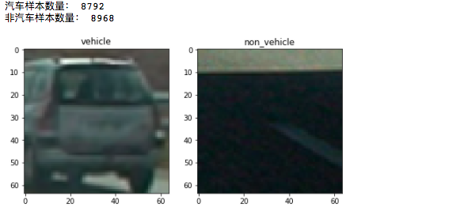
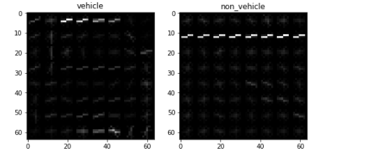
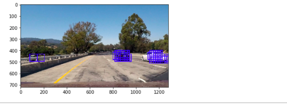
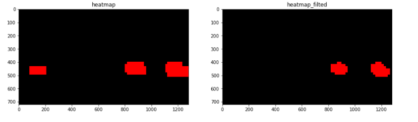
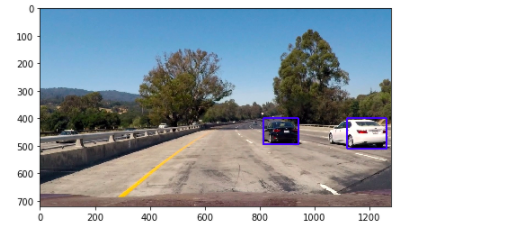
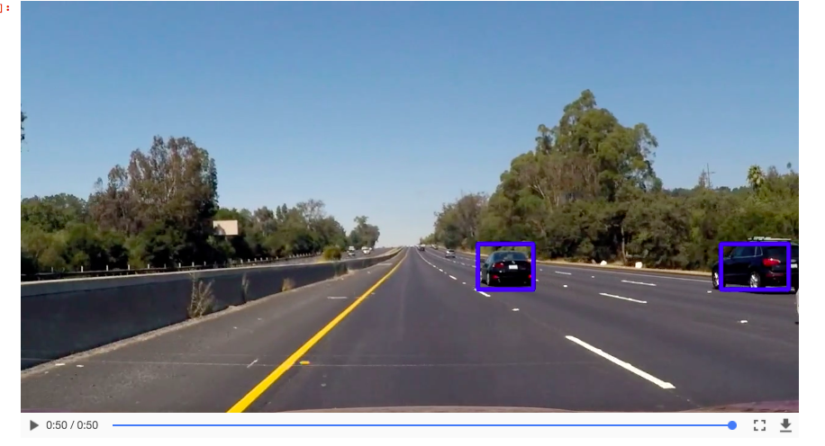

## 车辆检测
将会进行如下操作：

1. 定义图像特征提取方

2. 读入车辆和非车辆图像数据

3. 数据预处理，shuffle，标准化

4. 训练模型，使用的是svm

5. 测试模型

6. 使用滑动窗口和多尺度的图像大小在图像上检测车辆

   - 滑动窗口
   - 多尺度图像
   - heatmap
   - label
   - box center

7. 检测视频中行驶的车辆

   ​

**总结：车辆检测主要是两方面的内容，1:物体识别  2:滑动窗口** 


- 汽车和非汽车图片展示

  ```python
  import glob
  import matplotlib.pyplot as plt

  vehicle_lable = 1
  non_vehicle_label = 0

  # 读入数据
  vehicles_file_paths = glob.glob("./vehicles/*/*.png")
  non_vehicles_file_paths = glob.glob("./non-vehicles/*/*.png")
  print("汽车样本数量：" , len(vehicles_file_paths))
  print("非汽车样本数量：" , len(non_vehicles_file_paths))

  # 显示汽车和非汽车图片
  vehicle_img = mpimg.imread(vehicles_file_paths[0])
  non_vehicle_img = mpimg.imread(non_vehicles_file_paths[0])
  fig, (ax1, ax2) = plt.subplots(1, 2 ,figsize=(8, 20))
  ax1.imshow(vehicle_img)
  ax1.set_title("vehicle")
  ax2.imshow(non_vehicle_img)
  ax2.set_title("non_vehicle")
  plt.show()
  ```

  

- 提取HOG特征

  > hog参数说明：
  >
  > orientations：每个cell直方图的方向的个数
  >
  > pix_per_cell：每个cell像素个数
  >
  > cells_per_block：每个block的cell个数

  ```python
  import numpy as np
  import cv2
  import matplotlib.image as mpimg 

  def convert_color(img, conv):
      """
      颜色空间转换
      """
      return cv2.cvtColor(img, conv)

  def get_hog_features(img, orient, pix_per_cell, cell_per_block, vis=False, feature_vec=True):
      """
      提取图像的hog特征
      """
      if vis == True:
          features, hog_image = hog(img, orientations=orient, 
                                    pixels_per_cell=(pix_per_cell, pix_per_cell),
                                    cells_per_block=(cell_per_block, cell_per_block),
                                    block_norm= 'L2-Hys',
                                    transform_sqrt=False, 
                                    visualise=vis, feature_vector=feature_vec)
          return features, hog_image
      else:
          features = hog(img, orientations=orient, 
                         pixels_per_cell=(pix_per_cell, pix_per_cell),
                         cells_per_block=(cell_per_block, cell_per_block),
                         block_norm= 'L2-Hys',
                         transform_sqrt=False, 
                         visualise=vis, feature_vector=feature_vec)
          return features

  # 测试提取HOG特征
  vehicle_img = mpimg.imread(vehicles_file_paths[0])
  non_vehicle_img = mpimg.imread(non_vehicles_file_paths[0])
  v_hog_feats,v_hog_imgs = get_hog_features(vehicle_img[:, :, 0], 9, 8, 2, vis=True, feature_vec=False)
  n_hog_feats,n_hog_imgs = get_hog_features(non_vehicle_img[:, :, 0], 9, 8, 2, vis=True, feature_vec=False)

  # 显示汽车和非汽车图片
  vehicle_img = mpimg.imread(vehicles_file_paths[0])
  non_vehicle_img = mpimg.imread(non_vehicles_file_paths[0])
  fig, (ax1, ax2) = plt.subplots(1, 2 ,figsize=(8, 20))
  ax1.imshow(v_hog_imgs, cmap="gray")
  ax1.set_title("vehicle")
  ax2.imshow(n_hog_imgs, cmap="gray")
  ax2.set_title("non_vehicle")
  plt.show()
  ```

  

- 提取空间特征和颜色直方图特征，且把之上的特征进行合并。

  ```python
  def bin_spatial(img, size=(32, 32)):
      """
      提取图像的空间特征
      """
      color1 = cv2.resize(img[:,:,0], size).ravel()
      color2 = cv2.resize(img[:,:,1], size).ravel()
      color3 = cv2.resize(img[:,:,2], size).ravel()
      return np.hstack((color1, color2, color3))

  def color_hist(img, nbins=32):
      """
      颜色直方图
      """
      channel1_hist = np.histogram(img[:,:,0], bins=nbins)
      channel2_hist = np.histogram(img[:,:,1], bins=nbins)
      channel3_hist = np.histogram(img[:,:,2], bins=nbins)
      hist_features = np.concatenate((channel1_hist[0], channel2_hist[0], channel3_hist[0]))
      return hist_features

  def extract_img_features(img):
      """
      把之上的图像处理方法进行综合，且对结果进行归一化处理
      """
      img = cv2.cvtColor(img, cv2.COLOR_RGB2YCrCb)
      hist_feature = color_hist(img)
      spatial_feature = bin_spatial(img)
      ch1 = img[:, :, 0]
      ch2 = img[:, :, 1]
      ch3 = img[:, :, 2]
      ch1_hog_feature = get_hog_features(ch1, 9, 8, 2)
      ch2_hog_feature = get_hog_features(ch2, 9, 8, 2)
      ch3_hog_feature = get_hog_features(ch3, 9, 8, 2)
      hog_features = np.hstack((ch1_hog_feature, ch2_hog_feature, ch3_hog_feature))
      features = np.concatenate((hist_feature, spatial_feature, hog_features))
      return features
  ```

- 根据上边的图像特征提取方法，对所有的数据进行特征提取

  ```python
  X = []
  y = []
  for path in vehicles_file_paths:
      img = mpimg.imread(path)
      features = extract_img_features(img)
      X.append(features)
      y.append(vehicle_lable)

  for path in non_vehicles_file_paths:
      img = mpimg.imread(path)
      features = extract_img_features(img)
      X.append(features)
      y.append(non_vehicle_label)
  ```

- 数据预处理

  > shuffle —> train_test_split—>StandardScaler
  >
  > 注意：数据标准化的时候，使用训练数据作为fit的对象。

  ```python
  from skimage.feature import hog
  from sklearn.model_selection import train_test_split
  from sklearn.utils import shuffle
  from sklearn.preprocessing import StandardScaler

  # shuffle
  X, y = shuffle(X, y)
  # split
  rand_state = np.random.randint(0, 100)
  X_train, X_test, y_train, y_test = train_test_split(X, y, test_size=0.2, random_state=rand_state)
  # scaller
  X_scaler = StandardScaler().fit(X_train)
  X_train = X_scaler.transform(X_train)
  X_test = X_scaler.transform(X_test)
  ```

- 训练模型

  ```python
  from sklearn.svm import LinearSVC

  svm = LinearSVC()
  svm.fit(X_train, y_train)
  ```

- 测试模型

  > 最后模型的准确率为：0.986204954955

  ```python
  from sklearn.metrics import accuracy_score

  predicts = svm.predict(X_test)
  score = accuracy_score(predicts, y_test)
  print("在测试数据上的准确率为：" + score)
  ```

- 从图片中检测汽车

  > **滑动窗口技术是关键**
  >
  > 因为不知道检测物体的大小，远的地方车辆看起来小，近的地方看起来大。为了得到合适的检测数据，需要图片进行适当的缩放。但是这样带来的后果是，计算量会急剧增加。可以采查找车辆只在图像的下半部分，因为上半部分是天空。为了提高效率，先对整幅图像进行HOG特征提取，然后再根据需要进行特征分割。

  ```python
  def find_cars(img, ystart, ystop, scale, svc, X_scaler, orient, pix_per_cell, cell_per_block, spatial_size, hist_bins):
      """
      检测当前图像中的所有可能的汽车位置
      """
      
      boxs = []
      draw_img = np.copy(img)
      img = img.astype(np.float32)/255
      
      img_tosearch = img[ystart:ystop,:,:]
      ctrans_tosearch = cv2.cvtColor(img_tosearch, cv2.COLOR_RGB2YCrCb)
      if scale != 1:
          imshape = ctrans_tosearch.shape
          ctrans_tosearch = cv2.resize(ctrans_tosearch, (np.int(imshape[1]/scale), np.int(imshape[0]/scale)))
          
      ch1 = ctrans_tosearch[:,:,0]
      ch2 = ctrans_tosearch[:,:,1]
      ch3 = ctrans_tosearch[:,:,2]

      # Define blocks and steps as above
      nxblocks = (ch1.shape[1] // pix_per_cell) - cell_per_block + 1
      nyblocks = (ch1.shape[0] // pix_per_cell) - cell_per_block + 1 
      nfeat_per_block = orient*cell_per_block**2
      
      # 64 was the orginal sampling rate, with 8 cells and 8 pix per cell
      window = 64
      nblocks_per_window = (window // pix_per_cell) - cell_per_block + 1
      cells_per_step = 2  # Instead of overlap, define how many cells to step
      nxsteps = (nxblocks - nblocks_per_window) // cells_per_step + 1
      nysteps = (nyblocks - nblocks_per_window) // cells_per_step + 1
      
      # Compute individual channel HOG features for the entire image
      hog1 = get_hog_features(ch1, orient, pix_per_cell, cell_per_block, feature_vec=False)
      hog2 = get_hog_features(ch2, orient, pix_per_cell, cell_per_block, feature_vec=False)
      hog3 = get_hog_features(ch3, orient, pix_per_cell, cell_per_block, feature_vec=False)
      
      for xb in range(nxsteps):
          for yb in range(nysteps):
              ypos = yb*cells_per_step
              xpos = xb*cells_per_step
              # Extract HOG for this patch
              hog_feat1 = hog1[ypos:ypos+nblocks_per_window, xpos:xpos+nblocks_per_window].ravel() 
              hog_feat2 = hog2[ypos:ypos+nblocks_per_window, xpos:xpos+nblocks_per_window].ravel() 
              hog_feat3 = hog3[ypos:ypos+nblocks_per_window, xpos:xpos+nblocks_per_window].ravel() 
              hog_features = np.hstack((hog_feat1, hog_feat2, hog_feat3))

              xleft = xpos*pix_per_cell
              ytop = ypos*pix_per_cell

              # Extract the image patch
              subimg = cv2.resize(ctrans_tosearch[ytop:ytop+window, xleft:xleft+window], (64,64))
            
              # Get color features
              spatial_features = bin_spatial(subimg, size=spatial_size)
              hist_features = color_hist(subimg, nbins=hist_bins)

              # Scale features and make a prediction
              test_features = X_scaler.transform(np.hstack((hist_features, spatial_features, hog_features)).reshape(1, -1))    
              #test_features = X_scaler.transform(np.hstack((shape_feat, hist_feat)).reshape(1, -1))    
              test_prediction = svc.predict(test_features)
              if test_prediction == 1:
                  xbox_left = np.int(xleft*scale)
                  ytop_draw = np.int(ytop*scale)
                  win_draw = np.int(window*scale)
                  boxs.append([(xbox_left, ytop_draw+ystart),(xbox_left+win_draw,ytop_draw+win_draw+ystart)])
      return boxs

  img = mpimg.imread("test_images/test1.jpg")
  boxs = find_cars(img, 400, 600, 1, svm, X_scaler, 9, 8, 2, (32, 32), 32)
  for box in boxs:
      cv2.rectangle(img, box[0], box[1], (0, 0, 255), 6)
  plt.imshow(img)
  plt.show()
  ```

  

- 使用heatmap去掉错误检测的数据

  > 错误检测的数据出现的频率不高，根据频率去掉低频率的数据点，保留高频率的数据点。

  ```python
  # 创建热度图
  heatmap = np.zeros_like(img[:, :, :]).astype(np.float)
  for box in boxs:
      heatmap[box[0][1]:box[1][1], box[0][0]:box[1][0], 0] += 1
  fig,(ax1, ax2) = plt.subplots(1, 2, figsize=(15, 20))
  ax1.imshow(heatmap)
  ax1.set_title("heatmap")
  heatmap[heatmap < 3] = 0 
  ax2.imshow(heatmap)
  ax2.set_title("heatmap_filted")
  plt.show()
  ```

  

- 使用label把检测到的区域外接矩形框。

  ```python
  from scipy.ndimage.measurements import label

  labels = label(heatmap)
  for car_number in range(1, labels[1] + 1):
      nonzero = (labels[0] == car_number).nonzero()
      nonzeroy = np.array(nonzero[0])
      nonzerox = np.array(nonzero[1])
      bbox = ((np.min(nonzerox), np.min(nonzeroy)), (np.max(nonzerox), np.max(nonzeroy)))
      cv2.rectangle(img, bbox[0], bbox[1], (0, 0, 255), 6)
     
  fig,ax1 = plt.subplots(1, 1, figsize=(7, 12))
  ax1.imshow(img)
  plt.show()
  ```

  

- 设置中心点检测判断

  > 每检测完一幅图像，记录一下在该图像中检测到的矩形框的中心点。下次检测到的矩形框判断是否有中心点在其中。这样可以减少错误的判断。

  ```python
  box_center = []
  def detect_object(img):
      
      bbox_list = []
      # 分别对各个尺度的窗口查找汽车的位置
      boxs = find_cars(img, 400, 656, 1.2, svm, X_scaler, 9, 8, 2, (32, 32), 32)
      bbox_list = bbox_list + boxs
      boxs = find_cars(img, 400, 600, 1, svm, X_scaler, 9, 8, 2, (32, 32), 32)
      bbox_list = bbox_list + boxs
      boxs = find_cars(img, 400, 500, 0.8, svm, X_scaler, 9, 8, 2, (32, 32), 32)
      bbox_list = bbox_list + boxs
      # 创建热度图
      heatmap = np.zeros_like(img[:, :, 0]).astype(np.float)
      for box in bbox_list:
          heatmap[box[0][1]:box[1][1], box[0][0]:box[1][0]] += 1
      # 排除掉出现频率小的汽车检测位置
      heatmap[heatmap <=8] = 0
      # 对汽车的位置进行标记，画矩形
      labels = label(heatmap)
      for car_number in range(1, labels[1] + 1):
          nonzero = (labels[0] == car_number).nonzero()
          nonzeroy = np.array(nonzero[0])
          nonzerox = np.array(nonzero[1])
          bbox = ((np.min(nonzerox), np.min(nonzeroy)), (np.max(nonzerox), np.max(nonzeroy)))
          if len(box_center) > 0:
              for center in box_center:
                  if bbox[0][0]  < center[0] < bbox[1][0]  and bbox[0][1] < center[1] < bbox[1][1]:
                      cv2.rectangle(img, bbox[0], bbox[1], (0, 0, 255), 6)
                      break
          box_center.append(((bbox[0][0]+bbox[1][0] )/2, (bbox[0][1] + bbox[1][1])/2))
      return img
  ```

- 处理视频中的车辆检测

  ```python
  from moviepy.editor import VideoFileClip

  clip1 = VideoFileClip("project_video.mp4")
  white_clip = clip1.fl_image(detect_object)
  #white_clip.write_images_sequence("test_challenge/frame%2d.jpg")
  white_clip.write_videofile("project_video_output.mp4", audio=False)
  ```

- 展示，视频地址 [点这里]("project_video_output.mp4")

  ```python
  from IPython.display import HTML

  HTML("""
  <video width="960" height="540" controls>
    <source src="{0}">
  </video>
  """.format("project_video_output.mp4"))
  ```

  